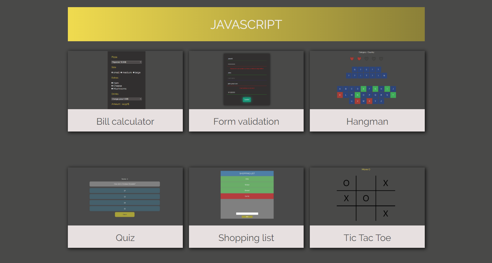

Repository created to keep in one place my code during learning JavaScript. 

My main goal was to use only HTML, CSS, AJAX (to send fake requests) and pure JavaScript to focus on elementary skills, before using frameworks like Angular or React.

I used Node.js/Express.js just to run website on my smartphone via LAN (at first I had idea to create REST API using Node but it will be another project).

Every (website) subpage in this respository is like mini project, because I think they are too small to keep them in seperate respositories :

- Bill calculator
- Form validation
- Hangman game
- Quiz
- Shopping list
- Tic Tac Toe game

  

